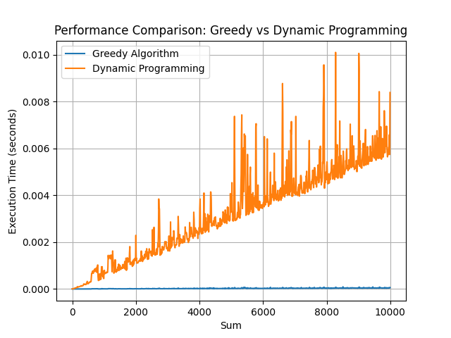

# Greedy vs Dynamic Programming

## Greedy algorithm to find the minimum number of coins

```
python find_coins_greedy.py

# Available coins: [50, 25, 10, 5, 2, 1]
# Target sum: 113
# Coins used:
#   50 cents: 2 coin(s)
#   10 cents: 1 coin(s)
#   2 cents: 1 coin(s)
#   1 cents: 1 coin(s)
# Success: The full sum was achieved!

# Available coins: [50, 25, 10, 5]
# Target sum: 113
# Coins used:
#   50 cents: 2 coin(s)
#   10 cents: 1 coin(s)
# Warning: Could not achieve the full sum. Remaining amount: 3 cents

# Available coins: [10, 6, 1]
# Target sum: 12
# Coins used:
#   10 cents: 1 coin(s)
#   1 cents: 2 coin(s)
# Success: The full sum was achieved!
```

## Dynamic algorithm to find the minimum number of coins

```
python find_min_coins.py

# Output
Available coins: [50, 25, 10, 5, 2, 1]
Target sum: 113
Coins used:
  1 cents: 1 coin(s)
  2 cents: 1 coin(s)
  10 cents: 1 coin(s)
  50 cents: 2 coin(s)
Success: The full sum was achieved!

Available coins: [50, 25, 10, 5]
Target sum: 113
Coins used:
Warning: Could not achieve the full sum. Remaining amount: 113 cents

Available coins: [10, 6, 1]
Target sum: 12
Coins used:
  6 cents: 2 coin(s)
Success: The full sum was achieved!

```

## Performance test

```
python plot_performance.py

```



## Conclusion [EN](comparison_en.md) [UA](comparison_ua.md)
